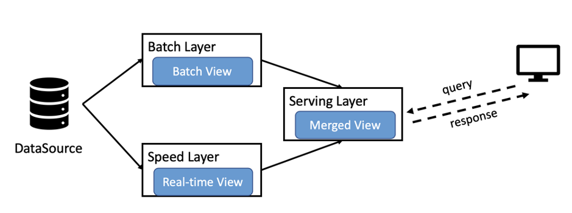
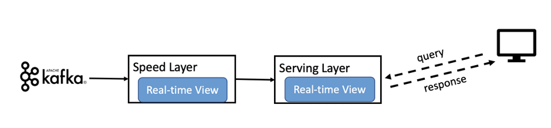
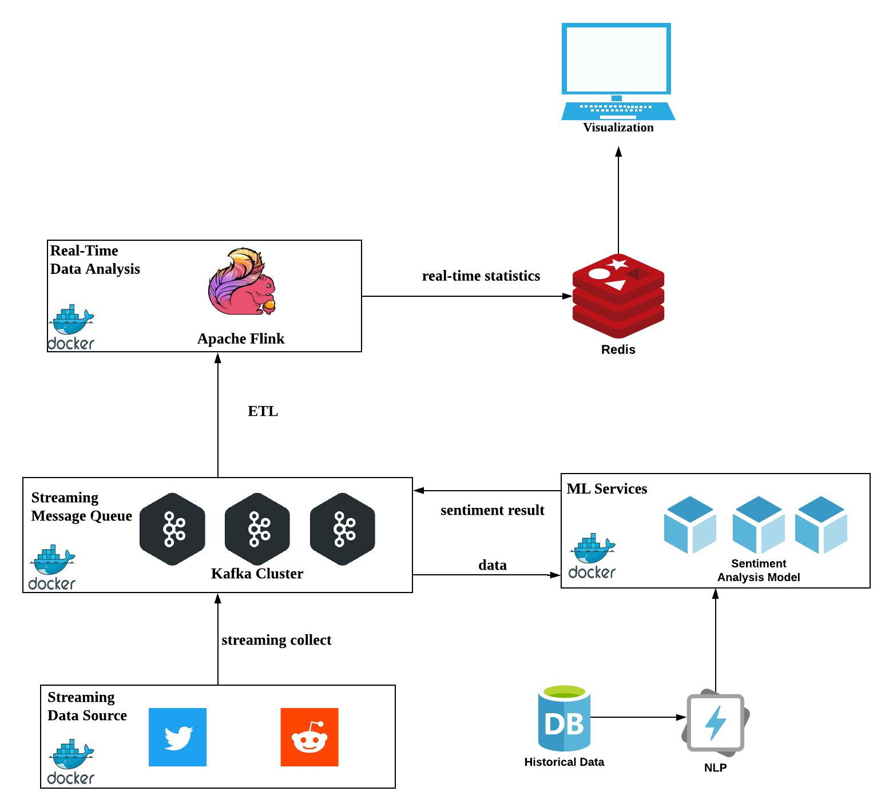
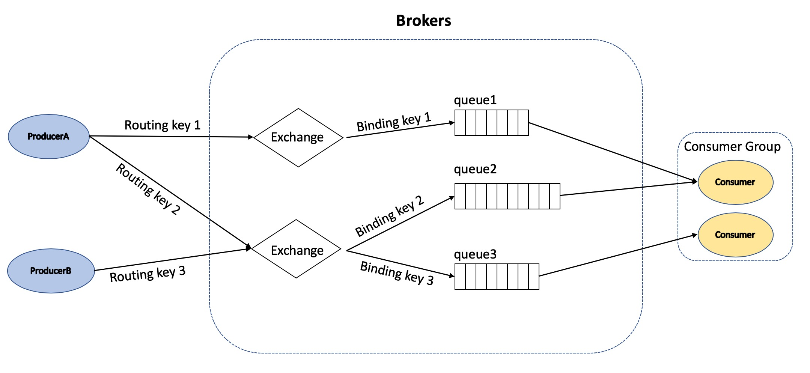
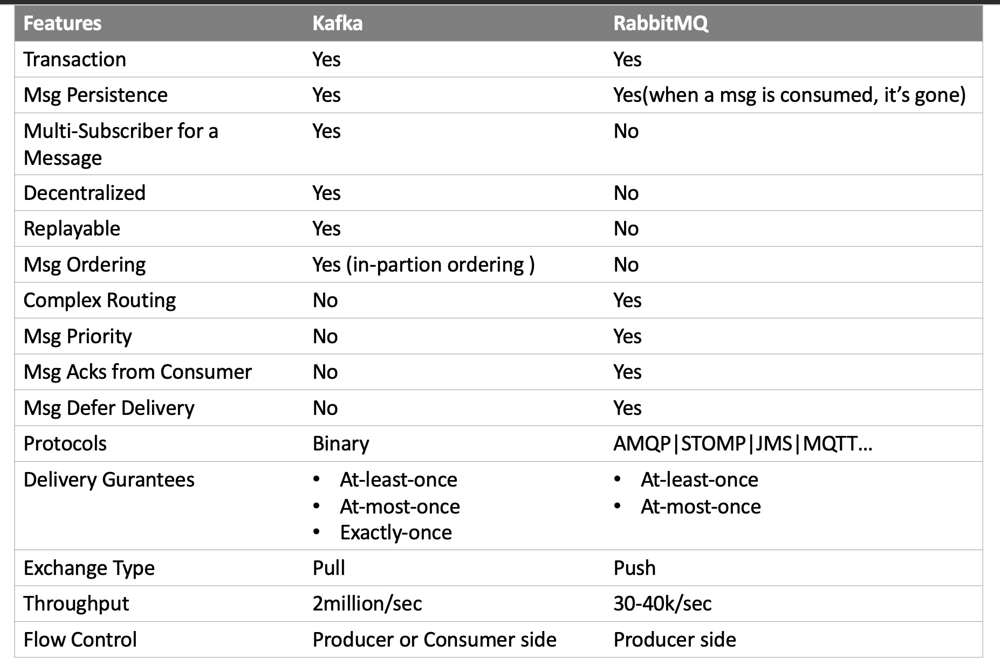
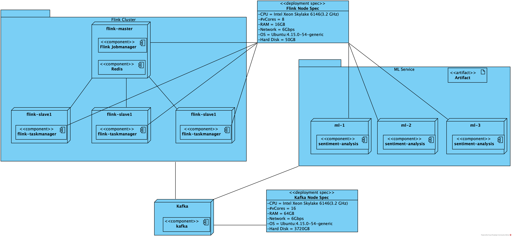

# Title
Real-time Cryptocurrency Analysis System

# Contacts
Liang, Zhihao  kelliang@connect.hku.hk
Wang, Xue

# Outline
0. Abstract
1. Introduction
2. Background
3. Related Works
4. System Architecture
5. Experimental Evaluation
6. Discussion
7. Conclusion
8. References

# Abstract
Since the creation of Bitcoin, cryptocurrencies are attracting significant attentions from researchers. They have been proposing many solutions for analysing the price trend. One dimension of these researches is to analyse the sentiment trend in social media like Twitter and Reddit. Some of these solutions even implement near real-time processing on Spark framework. However Spark is a framework dedicated for batch processing, which suffers from high latency. To minimize latency, Spark has implemented streaming API by applying micro-batch processing. But its performance in iterative or interactive applications is still unsatisfactory. In the area of capital market, the price fluctuation is very fast and sharp. Analytics and stakeholders are demanding a timely system that can assist their decision making. In this context, the demand for a truely real-time crypotocurrency analysation platform is rising rapidly. In this paper, we proposed a Flink-based cryptocurrency analyzation system that can handle massive amount of data in real-time. Streaming data is evaluated continuously and the result is updated in seconds, not days or months.

# Introduction
Cryptocurrency is a kind of digital asset that's decentralized and secured by strong crypotography algorithms. Satoshi Nakamoto (2009) created the first generation cryptocurrency: Bitcoin in 2009. The validity of Bitcoin is provided by blockchain technology. A blockchain is a continuously growing list of records which is linked by hash function. Hash function ensures that non of the records can be modified without being caught by others.

Since 2009, many other altcoins have been created. There are over 5000 altcoins in the cryptocurrency market till May 2020. Bitcoin and all of the altcoins are collectively called cryptocurrency. The most famous altcoins include Ripple, Litecoin, Monero etc. They are created as a substitution for Bitcoin. These altcoins claim to offer better anonymity and faster transaction confirmation. However Bitcoin still take the lion share of the crypto market. As of May 13, 2020, Bitcoin dominants 67.2% of the crypto market at the price $8893 (coindesk,2020). Cryptocurrency market is highly fluctuated, over 30% of price fluctuation happens every day. The historical high of Bitcoin is $20089 on Dec 17 2017. After one year, the price decline to as low as $3245 on Dec 17 2018 (coindesk,2020). With this sharp volatility, investors need a price prediction system that can assit their decision making. 

The Efficient Market Hypothesis (Malkiel,2003) states that current stock prices have reflected all the available information. And price variation is largely driven by incoming information. These new information broadcast on social media like twitter and reddit rappidly. Researchers have devoted to find the correlation between public mood and stock price. One approach is to do sentiment analysis on social media comments by applying machine learning algorithms. 

Baker & Wurgler(2007) defined 'sentiment' as the investor beliefs of investment return and risk in future. Sentiments reveal the correlation between investors attention and stock price. They proposed several potential proxies of sentiments, including news, investor surveys, trading volume etc. These sentiment proxies usually lag behind current status for days. Da, Engelberg & Gao (2011) used Google Search Volume Index (SVI) as a sentiment proxy, whch is more timely than the others. But it's based on google search volume, instead of text analysis. Colianni, Rosales & Signorotti (2015) inspected how tweet sentiment result could impact investment strategies. They applied basic machine learning algorithms on collected tweets, and yield 90% accuracy. Mohapatra, Ahmed & Alencar (2019) moved a step forward to support real-time price prediction by using Spark streaming framework. The system achieved high throughput but still suffer from high latency. This is because that Spark streaming is not a native streaming framework, it implements streaming by mini-batching. 

In this paper, we will replace Spark streaming with Flink and implement a system that provides well balance between throughpt and latency. Previous research have done so well on sentiment analysis, and the existing models provide high enough accuracy. The main objective of this paper is not to invent or enhance sentiment models but to build a system that can use existing models and produce real-time result.

The rest of paper is structured as follows. Section 2 describes the background of large scale distributed computation frameworks and stream processing. Section 3 surveys some related works that try to analyse cryptocurrency movement. Section 4 presents the architecture of our system. We will also illustrate reasons of software stack selcetion in this section. In section 5, we will show some experimental results and detail implementation. Senction 6 discusses the pros and cons of the system and direction of future work. Then the paper end with a conclusion in section 7.

# Background
## Traditional ETL and Business Intelligence
For many years, ETL (Extract, Transform and Load) (Denney, Long, Armistead, Anderson & Conway, 2016)) is the mainstrem procedure for business intelligence and data analysis. The objective of ETL is to extract data from source system, apply some transformation, and finally load into target datastore.

However traditional ETL systems are limited by their scalability and fault tolerent ability. According to a report presented in 2017 by IDC, the global data volume will grow expronentially from 33 zettabytes in 2018 to 175 zettabytes by 2025. IDC also forecasted that we would have 150 billions devices connected globally by 2025. And real-time data will account for around 30 percents of the global data (IDC, 2017). Traditional ETL can't process this huge volume of data in acceptable time. We demand for a system that's able to distribute computations to thousands of machines and runs parallely.

There are basically two ways to increase the throughput/scalability of data processing systems. One is scale up (vertical scaling), the other is scale out (horizontal scaling). For scale up, we use more powerful computation resources to improve the performance of the existing system. For example, we can purchase faster CPU or larger RAM to make each processing unit stronger. But this approach is limitted by some physical factors like: CPU/RAM/Network reach their capacity limits of current technology. Scale out would be a more cost-effective approach for most of the systems. It improves system performance by adding more commodity resources to the system. We can add more and more resources to the system to reach our disired state. This approach is very economic because commodity hardware is usually much cheaper than high performance ones. Many large scale processing frameworks has adopted the second approach, they are MapReduce, Hadoop, Spark, Flink and more others. We will introduce the background of these framworks one by one in the following sections. 

## MapReduce
MapReduce (Dean & Ghemawat, 2004) is a programming model that is able to process vast amounts of datasets in parallel. It's inspired by the map and reduce operation in functional languages like Lisp. MapReduce is compose of three core operations: map, shuffle and reduce. A job is usually splited into multiple independent subtasks and run parallely on the map stage. Then the outputed data from map stage is shuffled by its key, so that data with the same key occurence on the same workder node. Finally, reducers start processing each group of data in parellel. 

To take the advantage of locality, MapReduce schedule map tasks to machines that are near to the input data. This is opposite to traditional ETL, which pulls all needed data from data warehouse to the execution machine. MapReduce makes the decision based on the fact that data size is usually far more larger than map tasks code size.

## Hadoop
Hadoop (Shvachko, Kuang, Radia, & Chansler 2010) is a big data processing framwork inspired by GFS and MapReduce. It can scale out computation to many commodity machines. Hadoop is compose of Hadoop Distributed File System(HDFS) and Hadoop MapReduce. Both of the two components employ the master slave architecture. 

HDFS is a distributed file system that can manage large volume of data. It's an open source version of GFS. HDFS consists of a namenode and multiple datanodes. The namenode stores metadata of the distributed file system, including permissions, disk quota, access time etc. To read or write a file, HDFS clients must consult the namenode first. The namenode returns location awared metadata about where to read or write a file. Datanodes are where data actually stored. They register to the namenode and periodicly send heartbeats and block reports to the namenode. Block reports contain information of the blocks that datanode possesses. 

Hadoop MapReduce is a programming model for large scale data processing. Jobs are submmited through the jobtracker which is the master. The jobtracker keeps track of all MapReduce jobs and assign map or reduce tasks to tasktrackers. Tasktrackers are slave nodes which execute map or reduce tasks. The jobtracker monitors status of tasktrackers through heartbeats sent by tasktrackers. If a tasktracker is down, the jobtracker will reschedule those tasks to other tasktrackers.

## Kappa architecture and Lambda Architecture
To accomodate the need for both high throughput and low latency, Marz & Warren(2015) proposed a mixed architecture: lambda architecture. Lambda architecture is a data processing paradigm that is capable of dealing with massive amount of data. It mixes both batch and stream processing methods. Lambda architecture is compose of batch layer and speed layer. The batch layer is focus on increasing the accuracy by taking account into all available data. The result produced by batch layer is equivalent to equation "query result = f(all data)". Where f is the processing logic for the data. The speed layer is mainly focus on providing immediate view to the new incoming data. Query from clients are answered through the serving layer, which merges result from both batch layer and speed layer.

Kappa architecture is a simplified architecture with batch processing system removed. It's proposed by Jay Kreps on an O'Reilly blog in 2014. The architecture enables analytics do data processing with a single technology stack. In Kappa system, streaming data is processed in the speed layer and pushed to serving layer directly. Unlike lambda architecture, you don't have to maintain two set of code for batch layer and speed layer seperately. Kappa unifies batch and stream processing by treating batch processing as special stream processing.

## Spark
Hadoop has been a successful big data processing framework for years before the come up of Spark. Spark (Zaharia, Chowdhury, Franklin, Shenker,& Stoica, 2010) is a cluster big data framework that supports in-memory computing. The main contribution of Spark is that it introuduces the RDD data model into big data analysis area. This increases efficiency in processing interactive and iterative jobs. Hadoop MapReduce is not designed to reuse imtermidiate results. To reuse these results, we have to save them back to HDFS and reload them into memory at next iteration of MapReduce. This incurs performance penalty due to disk IO.  Spark minimizes the overhead by introducing in the resilient distributed datasets (RDD). A RDD is a collection of read only records that are partitioned across many machines. A RDD is created from external storage or other RDDs by the transformation operation. It can be explicitly cached in memory for reusing by multiple MapReduce tasks. To reuse a RDD in the future, users can persistent it to external storage. Fault tolerance of RDD is achieved by recording the lineage of the RDD. Lineages include information about how the RDD is drived from other RDDs. A RDD can be rebuilt if it's lost or crushed. <todo>Spark’s architecture consists of a Driver Program, a Cluster Manager and Worker Nodes</todo> <todo>Spark stream and micro-batch streaming</todo>

## Flink
Apache Flink (Carbone, Katsifodimos, Ewen,  Markl, Haridi & Tzoumas, 2015) is a distributed stateful stream processing framework. It is based on kappa architecture which unifies stream and batch data processing. Flink can be used in many different senarios. Many applications in mega companies are powered by Flink. For example, Alibaba's Blink is a Flink based search engine. Tencent's Oceanus is a real-time stream processing platform that takes the advantages of apache Flink. Kinesis, a stream service on AWS cloud is another famous platform powered by Flink. 
 
A benchmark done by Dongen, Steurtewagen, & Van(2018) shows that Flink outforms Spark streaming in two aspect. One is that Flink processes streaming data with the lowest latency. The other is that Flink provides better balance between latency and throughput. Because it supports more flexible windowing and time semantics. Flink employes the master slave structure, where jobmanager is the master and taskmanagers are slaves. Jobmanager is responsible for scheduling tasks, coordinating checkpoints and recovery. Taskmanagers consist multiple task slots, which can execute task operators. Taskmanagers periodically report their status to the jobmanager by sending heartbeats.

There are five basic building blocks that compose Flink: stream, state, time, window and checkpoint.

Streams can be bounded or unbounded. Unbounded streams are streams never ended, while bounded streams are fix-sized datasets. Flink provides a DataStream API for unbounded stream and a DataSet API for bounded stream. DataSteam and DataSet API transformations are compiled into a DAG graph by client program. The DAG graph is then submitted to the Jobmanager for scheduling to Taskmanagers.

Flink supports flexible window mechanism for the DataStream API, including time window and count window. A window declaration consist of three functions: a window assigner, a trigger and an evictor. The window assigner assigns incoming data to windows. The trigger dertermines when the process function of the window start excuting. The evictor removes some data out of the window according to provided criteria. 

Time management is also critical for stream processing. Flink offers flexible notion of time: event time, ingestion time and processing time. It provides powerful time operations like watermark and trigger that can handle out of order events. While Spark streaming and Storm do not provide these fine grained operations. Moreover, Flink allows lateness events by defering computation.

Transformation operators can keep states like counter, machine learning model or intermediate aggregation result. States are key-value store embeded in stateful operators. Since states can be accessed locally, Flink applications achieve high throughput and low latency. Flink offers exactly-once state consistency by regularly checkpointing operator states to external storage. Flink employs light weight Chandy-Lamport algorithm for asynchronous distributed checkpointing. The algorithm allows checkpointing without halting the execution of tasks. So, checkpoint and normal task execution can run in parallel. 

There are many options for Flink cluster deployment. Your may deploy it as a standalone cluster or on resource management platforms like YARN, Mesos, Kubernetes etc.

# Related Works

# System Architecture
RCAS is a system aims at providing cryptocurrency investors some insights via sentiment analysis. The analysis starts by collecting comment messages from social media. We extract those features that we concern and filter out the others. Then, these preprocessed data are fed into our sentiment analysis model and produce some sentiment statistics. The next step is to aggregate these sentiment analysis and display it on a dashboard.

The overall architecture of RCAS system is shown in Figure 1. The system consist of five subsystems. (1) a streaming data source that collect data from Twitter streaming API; (2) a streaming message queue that stores and distribute data collected from data source; (3) a machine learning service that provides sentiment analysis services; (4) a streaming data analysis subsystem that can analyse data in distributed cluster; (5) a visualization module for displaying results. Our system runs and benchmarks on public cloud. To enable fast deployment, each of the subsystems runs as docker container. In the following sections, we will introduce these subsystems one by one.

## Streaming Data Source
Streaming data source is a submodule that can streamingly push data into our system. It collects cryptocurrency related data from social media or any other channel. And performs some filtering that removes corrupted data. Then publishes them to the streaming message queue. Any social media platform are fine, such as twitter, reddit and facbook etc. The only difference is that the more diversify demogrphics is the platform the better result we will get.

## Streaming Message Queue
Streaming message queue is one of the core building blocks of the system. It plays as a message broker that collect and distribute immediate results. All of the data collected from data source phase are pushed to the streaming message queue. The message queue is a Kafka cluster composed by multiple brokers.

There are many alternative databases or file systems like HDFS/MySQL for storing collected data. However, these storage alternatives are more suitable for batch processing than streaming processing. We prefer Kafka for two reasons: First, we really don't care about data lost. According to the official statistics from twitter, the number of tweets sent per day is over 500 million. Loosing some of the messages will not affect our analysis much. So, at-most-once delivery semantics is sufficient for our case. Second, we really care about throughput and latency. Because cryptocurrecy market vary every seconds. 

MySQL is a traditional database that provides a rich set of transactionl operations. However, it's not suitable for storing large volume of data. Because it's not designed as a distributed database, and its throughput is limitted by a single machine. The rigorous schema structure makes MySQL unflexible for storing some document or logging data. MySQL also enforce strict integrety constraint and locking, which reduces its throughput.

HDFS is a distributed file system that can provide high throughput. Multiple data blocks of the same file can be read from multiple data nodes parallelly. The blocks size of HDFS is usually larger than 64MB. This minimizes seek time of disk read head, and increase throughput. But the latency of HDFS is still at high level since it need to load data from disk for each read. 

Kafka is a better choice that provides both high throughput and low latency. Kafka is an open sourced distributed messaging system for dealing with logs. In Kafka, a stream of messages is called a topic. Message producers can publish new messages to the topic. And message consumers can pull messages from a perticular topic. Brokers are intermediate exchange that store messages from producers and distribute them to consumers. <todo>Figurexxx shows the architecture of Kafka</todo>

To maximize throughput, a topic of Kafka is usually decomposed into multiple disjointed partitions. Thesee partitions are distributed among brokers that form the cluster. With this horizontally scalable architecture, multiple producers and consumers can operate on the same topic at the same time. Kafka also replica each partition to different brokers, this improves read throughput and prevents data lost. Additionally, Kafka increase throughput by batching messages and sending asynchrounously. Batching messages amortize network traffic overhead like connection establishment. Sending messages asynchrounously could saturate network capacity instead of blocking by receivers. 

Kafka reduce latency by relying on page cache and zero-copy. In a typical publish-subscribe system, consumers is usually lagging producers a little bit. At this case, consumers read data from page cache directly without having to access disks. 

Other message queues like ActiveMQ, RabbitMQ, RocketMQ and ZeroMQ can be a potential replacement for Kafka. Unlike Kafka, a log based message queue, they implement multiple messaging protocols like STOMP, AMQP, MQTT etc. Due to limited space, we only make a comarison between Kafka and RabbitMQ. 

The main difference between the two is that Kafka offers higher throughput and is more horizontaly scalable. While RabbitMQ supports priority messaging and consumer acks. Our system values high throughput and low latency, and we don't care whether consumers have received messages. Here is a more detailed comparison:

## Machine Learning Services

## Real-Time Data Analysis
Data processed by ML service is then ready for aggregation analysis. The framework that we used for this phase is apache Flink. In previous sections, we have introduced some background of Flink, including its basic building blocks and architectures. Flink has been widely accepted in applications like fraud detection, anomaly detection and business event monitoring. It can handle both batch data and streaming data with the same underlying runtime environment. And provides flexible API for controling window, time and checkpointing. 

Spark is a direct competitor of Flink in stream processing area. Comparing to Spark streaming, Flink offers more fine-grained control for windowing incoming data. In Spark streaming, data are min-batched in processing time, and there is no option for batching in event-time. In the mean time, caculation of Spark streaming is triggered globaly instead of operator by operator. While in Flink, we can batch data in event time by specifying window assigner, and trigger caculation for each operator by setting its own trigger. 

In addition, Flink provides lower latency than Spark streaming, which is critical to our system. Our goal is to provide users with a system that can reveal the trend of cryptocurrencies timeliness. Flink can process incoming data in elementwise basis. While in Spark streaming, it has to wait enough of data that can form a mini-batch, which increases latency. With the considerations above, we decided to use Flink instead of Spark streaming. 
<todo>make a table comparison among Flink, Storm, Spark, Spark streaming</todo>

## Visualization
Aggregated results from Flink are then published to external datastore for visualization. The datastore we use is Redis, an in-memory data storage server. The output of our system includes a word count set and a tuple with 3 elements. Typically, the word count set contains only thousands of records, since the number of vocabulary in common use is just 3000. We need to update the word count set frequently. So, we need a datastore that supports fast update. 

Redis and memcached are potential candidates for the task. Memcached is a simple key-value in-memory store for small chunk objects. It's usually used as a distributed share memory and caching server. But memcached only support string data type. If you want some advanced functionalities, you must implement them by youself. Redis is a powerful key-value data structure server. It preserves data in main memory for later fast retrieval. By the way, Redis also supports persistence of data in the form of binary(RDB) or append only log(AOF). When Redis server is crushed, it can recover from latest RDB or AOF file. Redis supports multiple data types, including string, list, map, set, sorted set, bitmap and more. The speed of both memcached and Redis are extremely fast, they can handle more than 100,000 requests per second at a single node. 

Considering the flexibilites that Redis offers, we decide to use Redis as our result datastore. In our case, we use sorted set and string data type. String is for storing some running statistics and sorted set is for storing analysed results. We have a dashboard for displaying these results as well.

# Experimental Evaluation
In previous sections, we have presented the architectures of the rcas system. We have also demonstrated why we put Kafka, Flink and Redis into our toolkit package. In this section, we conduct experiments on the system. All experiments were carried out on Tencent cloud platform.

## System Deployment
<todo>Figurexxx shows the deployment specification of our system.</todo> The system is composed of 8 CVM(Cloud Virtual Machine) instance represented by cuboid. We have one Flink master running the jobmanager, and 3 Flink slaves running taskmanagers. Each taskmanager is managing 8 task slots with 12GB of RAM allocated in total. So, the Flink manager is actually managing 32 task slots. The Redis server is deployed on the same CVM instance as the Flink master. This doesn't degrade the performance much for the Flink master. Because it only need to manage 3 CVM instances. We also got 3 virtual instances for machine learning services. Each of the instance has 8 sentiment analysis servers (multiprocesses) running in parallel. To distribute workload evenly, we set up a nginx load balance server for dispatching incoming requestes to the underlying sentiment analysis servers. Flink cluster and machine learning cluster are computation intensive. We choose the 'CN3.2XLARGE16' instance type after considering budget and performance.

Here is the configuration 'CN3.2XLARGE16' of instance:

Components    Specifications
-------------------------
Instance Type CN3.2XLARGE16
CPU           Intel Xeon Skylake 6146(3.2 GHz)
#vCores       8
RAM           16GB
Network       5Gbps
OS            Ubuntu:4.15.0-54-generic
Hard Disk     1×50GB

We have one CVM instance for Kafka message queue. Instance type 'IT3.4XLARGE64' is very suitable to run Kafka brokers. It has 64GB memory and 16 vCPU corse. We can simulate a 16 broker cluster with only one machine. The configurations of 'IT3.4XLARGE64' are shown below:

<todo>should in table form</todo>
Components    Specifications
-------------------------
Instance Type IT3.4XLARGE64
CPU           Intel Xeon Skylake 6133(2.5 GHz)
#vCores       16
RAM           64GB
Network       6Gbps
OS            Ubuntu:4.15.0-54-generic
Hard Disk     1×50GB

## Streaming Data Collection
We collect real-time data from twitter and reddit streaming API. There are many other media platforms for data collection, like facebook, weibo etc. We choose twitter and reddit for the reason that they have the most largest and diversified population of users. As of Sep 2019, the number of daily active users in twitter is 152 million. International users makes up around 79% of the total users of twitter (Omnicore). When it comes to reddit, there are over 1515 millions unique active users in May 2020. 

Twitter provide a streaming API that returns tweets containing a set of keywords. The keywords we uses include #croptocurrency, #bitcoin and #ethereum etc. The Tweepy library can be used for experiment. It is a Python library that wraps many functionalities of twitter streaming API, and enables fast development. However there is rate limit for free API users. We can only initiate no more than 450 requests in 15 minutes window (Twitter Streaming API). To address this issue, one solution is to collect data in advance, another solution is to pay for API access. Unfortunately, the reddit streaming API has the same problem. Because our time and budget are limited, we decide to use archive data for our experiment. 

We have downloaded a reddit dataset from Kaggle, which is a machine learning competition and dataset platform. The dataset contains 3834035 comments from the 'cryptocurrency' subreddit from Dec 2017 to Mar 2018. Each comment has 24 attributes, including author,body,created_utc,score,subreddit etc. For the reason that our sentiment analysis model can only handle english sentences, comments written in language other than english are filtered out. Other unusual characters, emojis are also removed.

## Kafka Cluster
In our system, we have 16 Kafka broker. They are running on the same machine with 16 CPU cores, each topic are decomposed into 16 partitions. For each partition, there exists only one replica. Because data reliability is insignificant for our system. We have created two topics: one for collecting data from social media streaming API, the other is for storing messages which has been processed by our machine learning service. 

## Sentiment Analysis

## Data Aggregation
As mentioned in system deployment section, we run aggregation subsystem on a Flink standalone cluster with four Tencent 'CN3.2XLARGE16' CVM nodes. One of the four nodes plays as the jobmanager, the other three nodes play as taskmanager. Each taskmanager is configured to have 12GB memory and 8 task slots.

Data returned from sentiment analysis includes the following fields:

<todo>should in table form</todo>
Fields                Descriptions
-------------------------------------------------
sentiment_neg         Sentiment result, negative value
sentiment_neu         Sentiment result, neutral value
sentiment_pos         Sentiment result, positive value
sentiment_compound    Sentiment result, compound value

In particular, the three sentiment_xxx fields represent the weight of negative, neutral and positive mood correspondingly. Where sentiment_neg + sentiment_neu + sentiment_pos = 1. The sentiment_compound field consist the value takes into account of the other 3 sentiment values. In addtion to sentiment results, there are some other fields related to the tweets and reddits.

Tweets:
Fields                Descriptions
-------------------------------------------------
id_str                ID of this message
created_at            Creation time of the message
quote_count           Number of quotes by other users
reply_count           Number of reply by other users
retweet_count         Number of retweets byt other users
favorite_count        Count of favorite
geo                   Geology location
coordinates           GPS coordination
timestamp_ms          Timestamp of this message
lang                  Language
text                  Text body (user comments)

Reddits
Fields                Descriptions
-------------------------------------------------
id                    ID of this message
created_utc           Creation time of the message
subreddit_id          ID of subreddit that this message belongs to
score                 
stickied              
text                  Text body (user comments)

Our system presents two indicators of cryptocurrency price. One is a word cloud chart presenting 30 of the most commonly used words in user comments. The other is the percentage of negative, neutral and positive opinion in 3 minutes window. In order to measure the performance of the system, we also return the number of messages that have been processed, and duration since the bootstrap of the system.

### Word Cloud of Twitter User Comments
Word cloud is a chart that users can quickly perceive the most prominent term on it. The higher weight a term has, the larger font size it has on the chart. To produce a word cloud, we must supply a weighted list of words. The list should be in word-count pair form. Here is a sample list:

Words         Count
-------------------------
bitcoin       39882
good          28933
rise          18839
better        16893
iota          14283
eth           12898
...

As is shown on the sample weighted list, Bitcoin is the most frequently mentioned word with the count 39882. We conduct calculation by first extracting user comments text from each message. Second, we split these comments into words. We removed some common stop words, and preserve only english words. Then, we aggregate the count for each word. Finally, the results are written to Redis as a sorted set where score is the count of words. Our visualization subsystem extract the top 30 words by score and construct a word cloud for displaying. The word cloud of top 30 most common words is a good indicator that reveals the trend of user opinion. It displays the hot topics at the time, which gives investors some sense of what's going on in the market.

### Opinion Variation
We have done sentiment analysis for user comments in the machine learning subsystem. At this step, we would like to see the variation of user opinion in time series. Thus, we evaluate the proportion of different user opinion every 100 comments. The result is written to Redis as a sorted set with current timestamp as the score. A stepped area chart is used for displaying 20 of the most recent records. Users can see the opinion variation within one hour. It helps them to distinguish market variation and respond to it imediately. <todo>Figurexxx shows an example result</todo>

## Performance
We monitor the performance of our system by inspecting the number of messages it can process per second. The summary of results is provided in the following table:

#messages    sec    #messages/sec
----------------------------------
612,288      96     6378

The system can process around 6378 messages per second in our experiment. The bottleneck of the system is the sentiment analysis subsystem. There are two approach to improve the performance. One is to add more computing resources to the sentiment subsystem. The other approach is to ship some sentiment analysis containers to those machines that flink taskmanager reside. With the Redis datastore, you can also serve more than 100,000 clients concurrently.

# Discussion
In this section, we are going to present some of the future works that can be done to the current system. Our system is highly extendable, it's easy to integrate other social media source like reddit, facebook etc. It requires minimal changes to the data extraction logic and redeploy the program. Users can push data that they collected from other media to the Kafka cluster. Then they need to define the structure of these data and extract texts for sentiment analysis. 

Our system still has much room for improvements. First, We only used several features of each tweets. In future, we plan to extend the system to include more features of tweets. This will give our users a broader overview to current status of cryptocurrencyies. 

Second, the system running parameters (eg.window size) are hard coded, in future, we plan to make it configurable dynamically. We will optimize the system by taking into account user requirements.

Third, other indicators can be introduced into the system. Currently, we only got two descriptive indicators. More quantitative indicators can be measured and improve the predicting result by combining them together according to weight.

# Conclusion
In this paper, we presented a real-time cryptocurrency price analysis system that supports custormer decision making. We started by introducing the evolution of large scale data processing framework. And illustrated some pros and cons of using batch processing systems. Then, we demonstrated that the demand for stream processing framework is increasing rapidly. We compared several streaming frameworks: Storm, Spark streaming and Flink. We concluded that Flink is the framework that offers the most flexible functionalities. It's a native streaming processing framework which is natural in real world. We have implemented the system and have done some experiments to it. The system can handle over 6378 messages per second in our experiment.

# References
Coindesk, (2020). URL: https://www.coindesk.com/

Nakamoto, S. (2019). Bitcoin: A peer-to-peer electronic cash system. Manubot.

Malkiel, B. G. (2003). The efficient market hypothesis and its critics. Journal of economic perspectives, 17(1), 59-82.

Da, Z., Engelberg, J., & Gao, P. (2011). In search of attention. The Journal of Finance, 66(5), 1461-1499.

Baker, M., & Wurgler, J. (2007). Investor sentiment in the stock market. Journal of economic perspectives, 21(2), 129-152.

Colianni, S., Rosales, S., & Signorotti, M. (2015). Algorithmic trading of cryptocurrency based on Twitter sentiment analysis. CS229 Project, 1-5.

Mohapatra, S., Ahmed, N., & Alencar, P. (2019, December). KryptoOracle: A Real-Time Cryptocurrency Price Prediction Platform Using Twitter Sentiments. In 2019 IEEE International Conference on Big Data (Big Data) (pp. 5544-5551). IEEE.

Shvachko, K., Kuang, H., Radia, S., & Chansler, R. (2010, May). The hadoop distributed file system. In 2010 IEEE 26th symposium on mass storage systems and technologies (MSST) (pp. 1-10). IEEE.

IDC. (2017). The Digitization of the World From Edge to Core. URL: https://www.seagate.com/files/www-content/our-story/trends/files/idc-seagate-dataage-whitepaper.pdf

Denney, M. J., Long, D. M., Armistead, M. G., Anderson, J. L., & Conway, B. N. (2016). Validating the extract, transform, load process used to populate a large clinical research database. International journal of medical informatics, 94, 271-274.

Dean, J., & Ghemawat, S. (2004). MapReduce: Simplified data processing on large clus

Marz, N., & Warren, J. (2015). Big Data: Principles and best practices of scalable real-time data systems. New York; Manning Publications Co..

Jay Kreps. (2014). Questioning the Lambda Architecture. URL: https://www.oreilly.com/radar/questioning-the-lambda-architecture

Zaharia, M., Chowdhury, M., Franklin, M. J., Shenker, S., & Stoica, I. (2010). Spark: Cluster computing with working sets. HotCloud, 10(10-10), 95.

van Dongen, G., Steurtewagen, B., & Van den Poel, D. (2018, July). Latency measurement of fine-grained operations in benchmarking distributed stream processing frameworks. In 2018 IEEE International Congress on Big Data (BigData Congress) (pp. 247-250). IEEE.

Carbone, P., Katsifodimos, A., Ewen, S., Markl, V., Haridi, S., & Tzoumas, K. (2015). Apache Flink: Stream and batch processing in a single engine. Bulletin of the IEEE Computer Society Technical Committee on Data Engineering, 36(4).

Apache Flink Documentation. URL: https://ci.apache.org/projects/Flink/Flink-docs-stable/

Tweepy Documentation. URL: http://docs.tweepy.org/en/latest/

Twitter Streaming API. URL: https://developer.twitter.com/en/docs/tweets/filter-realtime/api-reference/post-statuses-filter

Omnicore. URL: https://www.omnicoreagency.com/twitter-statistics/#:~:text=Twitter%20Demographics&text=There%20are%20262%20million%20International,are%20on%20the%20platform%20daily.

Kaggle Cryptocurrency Subeddit Dataset. URL: https://www.kaggle.com/nickreinerink/reddit-rcryptocurrency